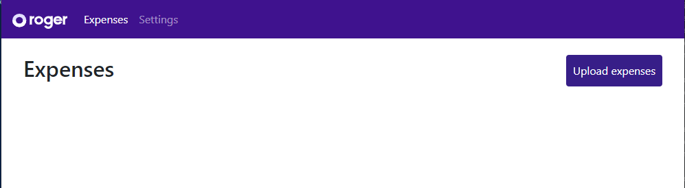
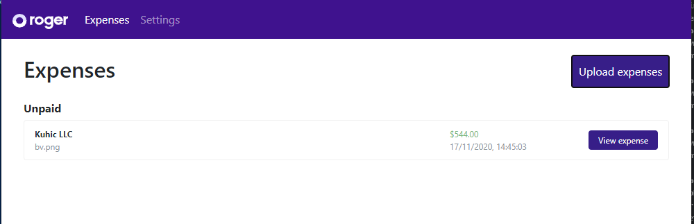
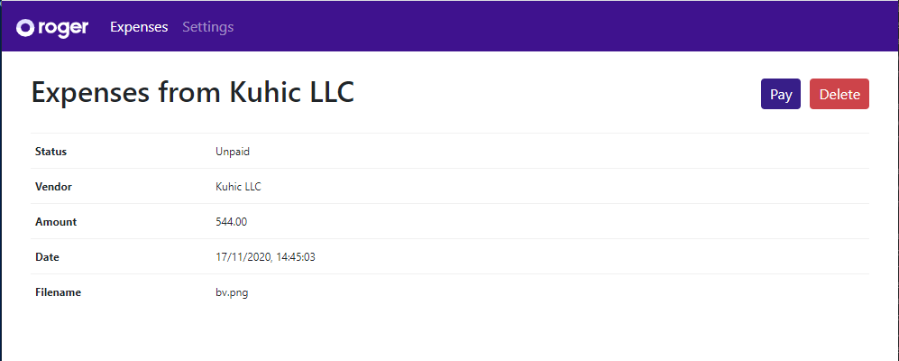

# Corpay One QA Take-home Test

Hi! We're super stoked that you're interested in working with us at Corpay One.

## Assignment

This repo is the outcome of web app that the front end engineer candidates are getting when they apply for a position in Roger. The app is a react app, that can upload, list and view expenses (it's all mocked), only with added Cypress to it. When you run `npm start` you'll see a simple UI with 2 menu items, and a button to upload the expense.

Your assignment is to fork this repo to your personal GitHub account and implement the following features:

- Get your self an overview of the functionality within the application
- Expand the Cypress tests with tests that covers the functionality in the application
- List all, if any, errors in the application

When you're done, submit a PR (containing one or more commits) targeting this repo's master branch.

## Time limit

From the time you receive access to this repo, you have 3 hours to complete the assignment and submit your PR.

You do not have to use all 3 hours. We value quality over speed, so make sure to do a good job instead of rushing.

If you exceed the 3 hours, no worries, just submit what you have. But, please, submit something within the time limit.

If you encounter an unexpected interruption and must leave the assignment unfinished, please reach out to us, and we'll accommodate.

**Note:** At Corpay One, we don't have deadlines like this, which could potentially mean rushed launches with sub-optimal user experiences. This is an assignment, and we want to set clear a expectation of how much of your time we expect.

## The UI

Here are some example of what the UI looks like. 
The default screen:

List expenses:

Show expense:

---

The rest of this README is the standard create-react-app README content, which describes how to start and test the app.

## Available Scripts

In the project directory, you can run:

### `npm start`

Runs the app in the development mode. 
Open [http://localhost:3000](http://localhost:3000) to view it in the browser.

The page will reload if you make edits. 
You will also see any lint errors in the console.

### `npm run cypress`

Runs cypress, see [cypress.io/](https://www.cypress.io/)

### `npm test`

Launches the test runner in the interactive watch mode. 
See the section about [running tests](https://facebook.github.io/create-react-app/docs/running-tests) for more information.

### `npm run build`

Builds the app for production to the `build` folder. 
It correctly bundles React in production mode and optimizes the build for the best performance.

The build is minified and the filenames include the hashes. 
Your app is ready to be deployed!

See the section about [deployment](https://facebook.github.io/create-react-app/docs/deployment) for more information.

### `npm run eject`

**Note: this is a one-way operation. Once you `eject`, you can’t go back!**

If you aren’t satisfied with the build tool and configuration choices, you can `eject` at any time. This command will remove the single build dependency from your project.

Instead, it will copy all the configuration files and the transitive dependencies (Webpack, Babel, ESLint, etc) right into your project so you have full control over them. All of the commands except `eject` will still work, but they will point to the copied scripts so you can tweak them. At this point you’re on your own.

You don’t have to ever use `eject`. The curated feature set is suitable for small and middle deployments, and you shouldn’t feel obligated to use this feature. However we understand that this tool wouldn’t be useful if you couldn’t customize it when you are ready for it.

## Learn More

You can learn more in the [Create React App documentation](https://facebook.github.io/create-react-app/docs/getting-started).

To learn React, check out the [React documentation](https://reactjs.org/).

### Code Splitting

This section has moved here: https://facebook.github.io/create-react-app/docs/code-splitting

### Analyzing the Bundle Size

This section has moved here: https://facebook.github.io/create-react-app/docs/analyzing-the-bundle-size

### Making a Progressive Web App

This section has moved here: https://facebook.github.io/create-react-app/docs/making-a-progressive-web-app

### Advanced Configuration

This section has moved here: https://facebook.github.io/create-react-app/docs/advanced-configuration

### Deployment

This section has moved here: https://facebook.github.io/create-react-app/docs/deployment

### `npm run build` fails to minify

This section has moved here: https://facebook.github.io/create-react-app/docs/troubleshooting#npm-run-build-fails-to-minify
